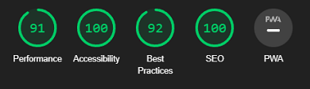
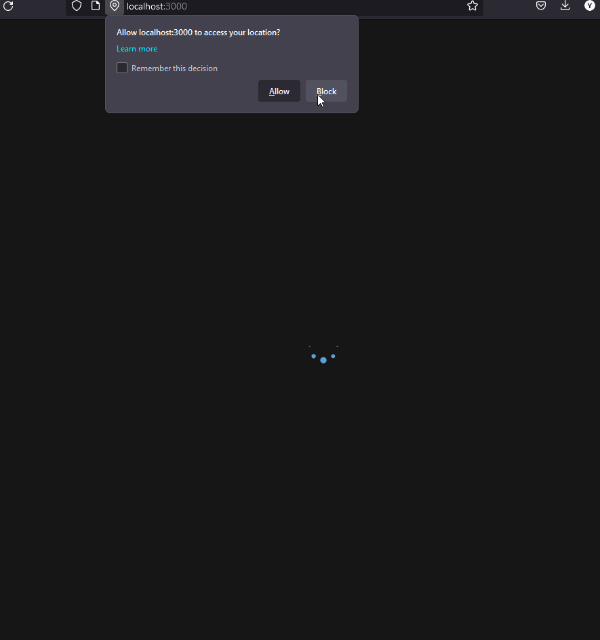
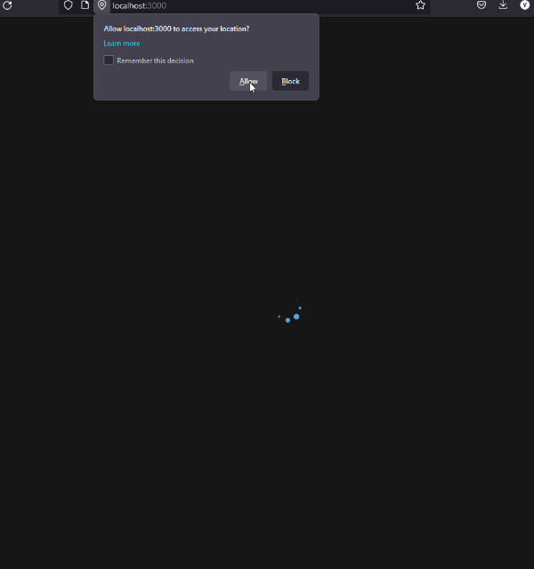

# **Weather app**

- [**Weather app**](#weather-app)
  - [**About the project**](#about-the-project)
  - [**Lighthouse rating**](#lighthouse-rating)
  - [**Tech stack**](#tech-stack)
  - [**Getting started**](#getting-started)
    - [Prerequisites](#prerequisites)
    - [Run/Test](#runtest)
  - [**Showcase**](#showcase)
    - [Block location](#block-location)
    - [Allow location](#allow-location)
    - [Search locations](#search-locations)

## **About the project**

---

This project was developed to learn how to request information from a REST API.

## **Lighthouse rating**

---



## **Tech stack**

---

<!-- markdownlint-disable MD033 -->
<p>
    <a href="https://developer.mozilla.org/en-US/docs/Glossary/HTML5" >
        
    </a>
    <a href="https://developer.mozilla.org/en-US/docs/Web/CSS" >
        
    </a>
    <a href="https://developer.mozilla.org/en-US/docs/Web/javascript" >
      
    </a>
    <a href="https://reactjs.org/" >
        
    </a>
    <a href="https://webpack.js.org/" >
            
    </a>
    <a href="https://babeljs.io/" >
            
    </a>
    <a href="https://eslint.org/" >
            
    </a>
    <a href="https://git-scm.com/" >
            
    </a>
</p>
<!-- markdownlint-enable MD033 -->

## **Getting started**

---

### Prerequisites

|     | Version | Installation                |
| --- | ------- | --------------------------- |
| npm | 9.6.4+  | `npm install npm@latest -g` |

### Run/Test

**Step 1:**

```bash
git clone git@github.com:YuneidyC/todo-app.git # Clone the repo
npm install # Install NPM packages
```

**Step 2:**

- Create an account at [**OpenWeather**](https://openweathermap.org/).
- Go to `Profile > My API keys`.
- Create a new key:
  - (Optional) Write a new name for your key.
  - Click `Generate`.
- **Check the status column and make sure that the new key is active**.
- Copy the key.
- Open `.env.example`, replace `<YOUR_API_KEY>` with your key and save.
- Rename the file `.env.example` to `.env.local`.

**Step 3:**

Open bash or powershell in the root of the repository and execute:

```bash
npm run start # Run the app
```

## **Showcase**

---

### Block location



### Allow location



### Search locations


